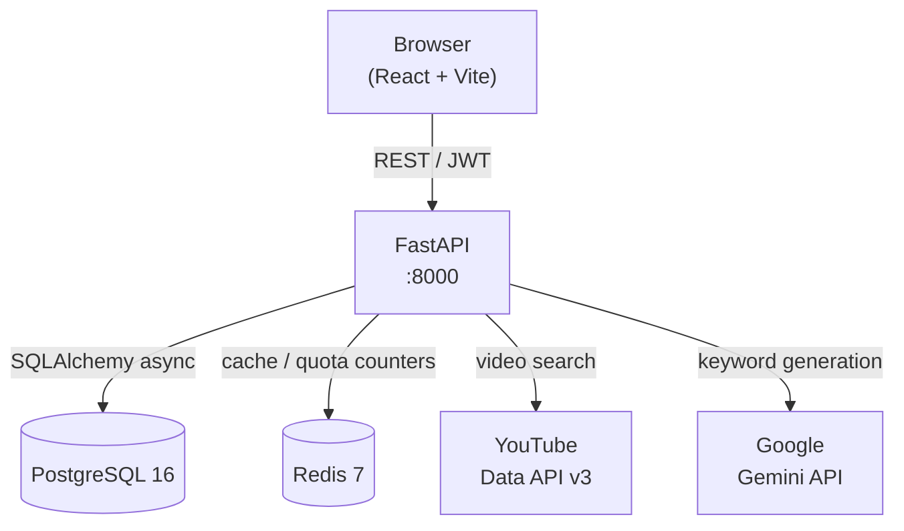

# ViralScout

> Discover viral YouTube video opportunities with AI-powered keyword generation and outlier analysis.

[](https://github.com/luisperaza/viral-scout-yt/actions)
[](LICENSE)
[](https://www.python.org/)
[](https://react.dev/)
[](https://www.typescriptlang.org/)
[](https://docs.docker.com/compose/)

<!-- TODO: Replace with a real screenshot or GIF once the UI is built -->
<!--  -->

```
┌─────────────────────────────────────────────────────┐
│                                                     │
│   [ Screenshot / GIF coming soon ]                  │
│                                                     │
│   Run `docker compose up --build` to see it live.   │
│                                                     │
└─────────────────────────────────────────────────────┘
```

## Features

- **AI keyword generation** — describe a niche, get optimized search terms via Gemini AI
- **Outlier score analysis** — ranks videos by views ÷ channel average (10x = ultra-viral)
- **Advanced filters** — language, video duration, subscriber range, date window
- **YouTube quota management** — smart caching to stay under the 10,000-unit/day limit
- **Search history** — every search saved, paginated, and replayable
- **JWT authentication** — secure sign-up / login with bcrypt-hashed passwords
- **Fully containerized** — one command from clone to running app

## Quick start

```bash
git clone https://github.com/luisperaza/viral-scout-yt.git
cd viral-scout-yt
cp .env.example .env        # add your API keys
docker compose up --build
```

| Service  | URL                          |
|----------|------------------------------|
| Frontend | http://localhost:5173        |
| Backend  | http://localhost:8000        |
| API docs | http://localhost:8000/docs   |

## Architecture



**Request flow:**
1. User describes a niche → Gemini generates keyword variants
2. Keywords → YouTube search (cache checked first, 100 quota units each)
3. Each video's channel stats fetched (1 unit each, cached 7 days)
4. Outlier score computed: `video_views / channel_avg_views_last_30`
5. Results ranked, stored, returned to the UI

**Outlier score thresholds:**

| Score  | Class        | Color  |
|--------|--------------|--------|
| ≥ 10×  | Ultra Viral  | Red    |
| 5–10×  | Very Viral   | Amber  |
| < 5×   | Normal       | Green  |

## Tech stack

| Layer      | Technology         | Why                                                       |
|------------|--------------------|-----------------------------------------------------------|
| Backend    | FastAPI            | Native async, automatic OpenAPI, Pydantic integration     |
| ORM        | SQLAlchemy 2.0     | Async-first, type-safe, migration support via Alembic     |
| Task queue | Celery + Redis     | Background jobs for async YouTube fetching               |
| Frontend   | React 19 + Vite    | Fast HMR, RSC-ready, modern React patterns                |
| State      | TanStack Query     | Server-state sync, caching, background refetch            |
| Styling    | Tailwind CSS 4     | Utility-first, zero dead CSS in production                |
| Database   | PostgreSQL 16      | ACID, JSONB for flexible metadata, proven at scale        |
| Cache      | Redis 7            | Quota counters (TTL 24h), search cache (TTL 1h)           |
| AI         | Google Gemini      | Cost-effective keyword generation with generous free tier |
| Infra      | Docker Compose     | Reproducible dev environment, prod-parity containers      |

## API documentation

Interactive docs available at **http://localhost:8000/docs** (Swagger UI) and **/redoc** (ReDoc) when running locally.

See [docs/api.md](docs/api.md) for the full endpoint reference.

**Core endpoints:**

```
POST  /api/v1/auth/register        Create account
POST  /api/v1/auth/login           Get JWT token
GET   /api/v1/auth/me              Current user

POST  /api/v1/keywords/generate    AI keyword generation from niche
POST  /api/v1/search               Execute YouTube search
GET   /api/v1/search/history       Paginated search history
GET   /api/v1/videos/:id           Video detail + outlier score
```

## Development

### Prerequisites

- Docker Desktop 4.x
- API keys: [YouTube Data API v3](https://console.cloud.google.com/apis/credentials) + [Google AI Studio (Gemini)](https://aistudio.google.com/app/apikey)

### Local setup

```bash
cp .env.example .env
# Edit .env: add YOUTUBE_API_KEY, GEMINI_API_KEY, and a strong JWT_SECRET

docker compose up --build
```

### Backend (without Docker)

```bash
cd backend
python -m venv .venv && source .venv/bin/activate   # Windows: .venv\Scripts\activate
pip install -e ".[dev]"

alembic upgrade head
uvicorn app.main:app --reload
```

### Frontend (without Docker)

```bash
cd frontend
npm install
npm run dev      # Vite dev server on :5173
```

### Useful commands

```bash
# Lint + format
cd backend && ruff check . && ruff format .
cd frontend && npm run lint

# Tests
cd backend && pytest --cov=app
cd frontend && npm run test

# Database migrations
cd backend && alembic revision --autogenerate -m "your message"
cd backend && alembic upgrade head
```

## Deployment

See [docs/deployment.md](docs/deployment.md) for the full guide (Railway + Vercel).

## Contributing

1. Fork the repo and create a branch: `feat/your-feature`
2. Follow [Conventional Commits](https://www.conventionalcommits.org/) for commit messages
3. Ensure `ruff`, `pytest`, and `npm run test` all pass
4. Open a PR using the template — include a description of what and why

## License

MIT © 2026 Luis Peraza — see [LICENSE](LICENSE) for details.
